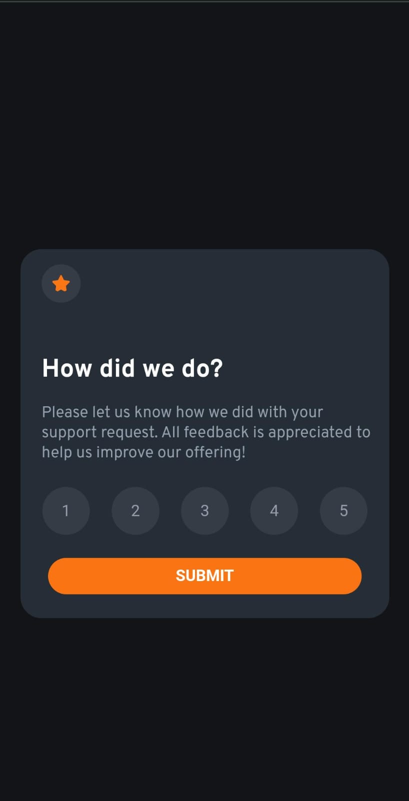
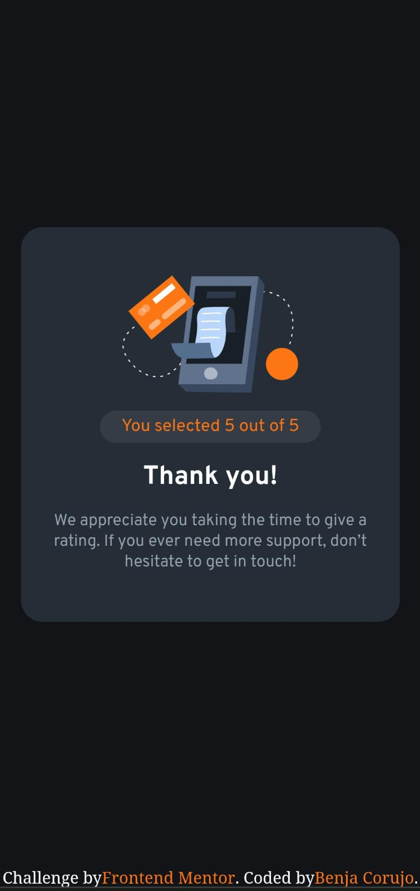

# Frontend Mentor - Interactive rating component solution

This is a solution to the [Interactive rating component challenge on Frontend Mentor](https://www.frontendmentor.io/challenges/interactive-rating-component-koxpeBUmI). Frontend Mentor challenges help you improve your coding skills by building realistic projects. 

## Table of contents

- [Overview](#overview)
  - [The challenge](#the-challenge)
  - [Screenshot](#screenshot)
  - [Links](#links)
- [My process](#my-process)
  - [Built with](#built-with)
  - [What I learned](#what-i-learned)
  - [Continued development](#continued-development)
  - [Useful resources](#useful-resources)
- [Author](#author)
- [Acknowledgments](#acknowledgments)

## Overview

### The challenge

Users should be able to:

- View the optimal layout for the app depending on their device's screen size
- See hover states for all interactive elements on the page
- Select and submit a number rating
- See the "Thank you" card state after submitting a rating

### Screenshot


.png)




### Links

- Live Site URL: https://Benja307.github.io/4challenge-frontendmentor/

## My process

### Built with

- Semantic HTML5 markup
- CSS custom properties
- Flexbox
- CSS Grid
- Sass
- JavaScript

### What I learned
```js
let numbers = document.querySelector('.numbers');
```
Con la función querySelector() puedo seleccionar un objeto de mi documento html que se lo paso como parámetro y posteriormente guardar el objeto en una variable para poder manipularlo cuando lo necesite.

```js
numbers.addEventListener('click', (event)=>{})
```
Con la función addEventListener() lo que hago es agregar una escucha a un determinado objeto de mi html, solo le debo pasar como parámetros el evento que espero por parte del usuario sobre dicho objeto y una función que se dispara una vez que dicho evento sucede.

### Continued development

Me seguiré enfocando en prácticar los conceptos básicos de JavaScript para añadir más interactividad a mis proyectos.
El proyecto presenta un bug, si seleccionamos una calificación del 1 al 5 y luego clickeamos en los espacios entre los botones, al darle a submit aparece un resultado defectuoso en la tarjeta de agradecimiento.

### Useful resources


## Author

- LinkedIn - https://www.linkedin.com/in/benjamin-corujo-14660824a
- Frontend Mentor - https://www.frontendmentor.io/profile/Benja307
- Instagram - @corujobenja_30

## Acknowledgments
